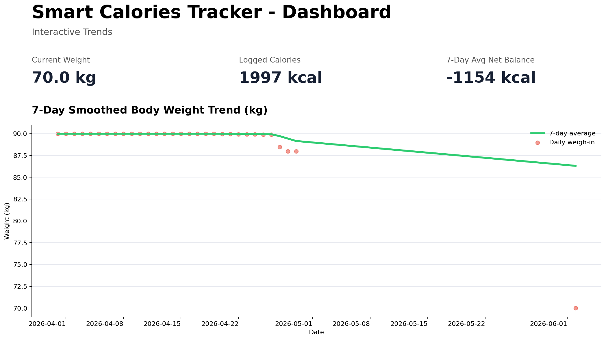
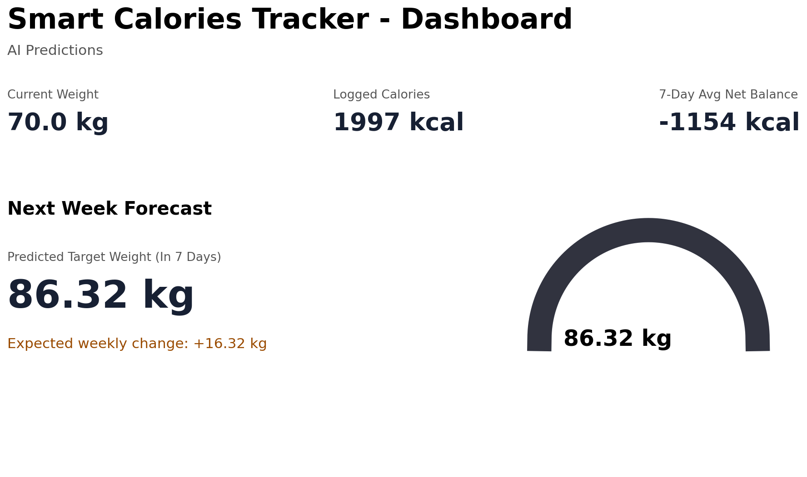
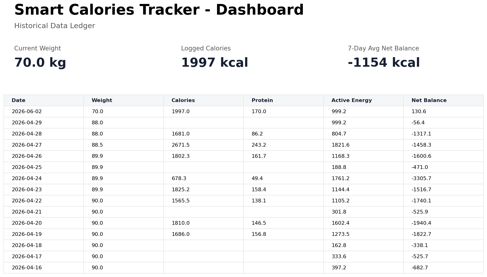

# Fitness ML Tracker

An end-to-end Streamlit and machine learning project for cleaning real-world fitness telemetry, engineering time-series features, and forecasting next-week body weight from calorie balance and rolling weight signals.

## Dashboard Preview

The Streamlit dashboard is the main user-facing artifact: it combines manual daily logging, KPI cards, interactive Plotly trends, model inference, and a historical data ledger.





## Core Highlight

**Real-world biometric processing**: this project ingests noisy personal health telemetry from fitness trackers and nutrition logs, then turns missing, irregular, and sensor-driven readings into model-ready features. The pipeline handles temporal sorting, interpolation, rolling windows, energy-balance calculations, and next-week target alignment.

## Model Card

| Item | Detail |
| --- | --- |
| Prediction task | Forecast 7-day smoothed body weight one week ahead |
| Model artifact | `model/weight_predictor.joblib` |
| Algorithm | Baseline-aware model selection: regularized XGBoost is trained, but the simpler current-weight baseline is saved when it generalizes better |
| Features | `Net_Calorie_7Day_Avg`, `Weight_7Day_Avg` |
| Target | `Target_Weight_Next_Week` |
| Evaluation split | Chronological 80/20 split, no shuffle |
| Training rows | 67 |
| Test rows | 17 |

| Model | MAE lower is better | RMSE lower is better | R2 higher is better | Within +/-0.5 kg | Within +/-1.0 kg |
| --- | ---: | ---: | ---: | ---: | ---: |
| Regularized XGBoost regressor | 0.3236 kg | 0.9271 kg | -0.1387 | 82.4% | 94.1% |
| Selected model: current 7-day weight baseline | 0.3212 kg | 0.9214 kg | -0.1249 | 82.4% | 94.1% |

The first XGBoost version overfit the flat training period: train MAE was `0.0000 kg`, while holdout MAE was `0.3236 kg`. To reduce overfitting, the training script now uses a regularized XGBoost configuration and compares it against a simpler rolling-weight baseline. Because XGBoost still does not beat the baseline on the chronological holdout, the saved `weight_predictor.joblib` artifact uses the baseline predictor. This is more honest and lower-risk for the current data size; the next modeling milestone is collecting more varied history before re-enabling a more flexible model.

Reproduce the metrics:

```bash
python model/train_model.py
```

Check the anonymized sample data:

```bash
python scripts/evaluate_sample_data.py
```

Regenerate the dashboard preview images:

```bash
python scripts/export_dashboard_screenshots.py
```

## Sample Data

The full raw dataset is personal, but the repository includes a small anonymized sample for review and smoke testing:

```text
data/sample/health_sample_anonymized.csv
```

The sample keeps the same schema as the raw daily telemetry while shifting dates and scaling biometric values so the pipeline structure is visible without exposing private measurements.

## Project Structure

```text
fitness-ml-tracker/
|-- src/
|   `-- app.py                         # Streamlit dashboard
|-- scripts/
|   |-- build_features.py              # Feature engineering pipeline
|   `-- Visualized_changes.py          # Visualization utilities
|-- data/
|   |-- raw/                           # Private/raw telemetry snapshots
|   |-- processed/                     # Feature-engineered data
|   `-- sample/
|       `-- health_sample_anonymized.csv
|-- docs/
|   `-- screenshots/                   # Dashboard proof-of-work images
|-- model/
|   |-- train_model.py                 # Training and evaluation script
|   |-- health_modeling_ready.csv      # Training data snapshot
|   `-- weight_predictor.joblib        # Trained model artifact
|-- requirements.txt
`-- README.md
```

## Quick Start

Install dependencies:

```bash
pip install -r requirements.txt
```

Launch the dashboard:

```bash
streamlit run src/app.py
```

Run feature engineering:

```bash
python scripts/build_features.py
```

Train and evaluate the model:

```bash
python model/train_model.py
```

## Core Features

### Time-Series Biometric Processing

- Daily telemetry ingestion for body weight, calories, active energy, basal energy, steps, and macronutrients
- Missing-value handling for incomplete tracker and nutrition logs
- Chronological alignment for time-dependent model training
- Rolling-window smoothing to reduce daily water-weight and logging noise

### Feature Engineering

- 7-day rolling average body weight
- 7-day rolling net calorie balance
- Tracker-estimated total daily energy expenditure
- Next-week regression target via look-ahead shifting
- Binary direction target for future classification experiments

### Predictive Modeling

- Baseline-aware predictor serialized with Joblib
- Chronological train/test split to avoid time-series leakage
- Regularized XGBoost comparison against current rolling weight
- Overfitting check via train-vs-test metrics
- Per-row test predictions printed during training for auditability

### Interactive Dashboard

- KPI cards for current weight, logged calories, and 7-day net calorie balance
- Interactive date-range filtering
- Trend tabs for weight, calories, protein, carbs, fat, and active energy
- AI prediction tab for next-week forecast once a model artifact is available
- Historical data ledger for row-level inspection

## Data Pipeline

```text
Raw telemetry -> cleaning -> feature engineering -> model training -> Streamlit dashboard
```

1. Raw daily health telemetry is collected from personal device and nutrition logs.
2. Cleaning scripts sort records by date, interpolate continuous tracker signals, and impute missing calories.
3. Feature engineering adds rolling averages, net calorie balance, TDEE estimates, and next-week targets.
4. `model/train_model.py` trains and evaluates the predictor.
5. `src/app.py` renders the dashboard and loads the saved model for inference.

## Recruiter Notes

This project is strongest as a practical data product: it shows an end-to-end workflow from messy personal telemetry to an interactive dashboard. Future commits should stay atomic and descriptive, for example:

- `add anonymized sample telemetry`
- `add model baseline comparison`
- `fix feature pipeline output paths`
- `capture Streamlit dashboard screenshots`
